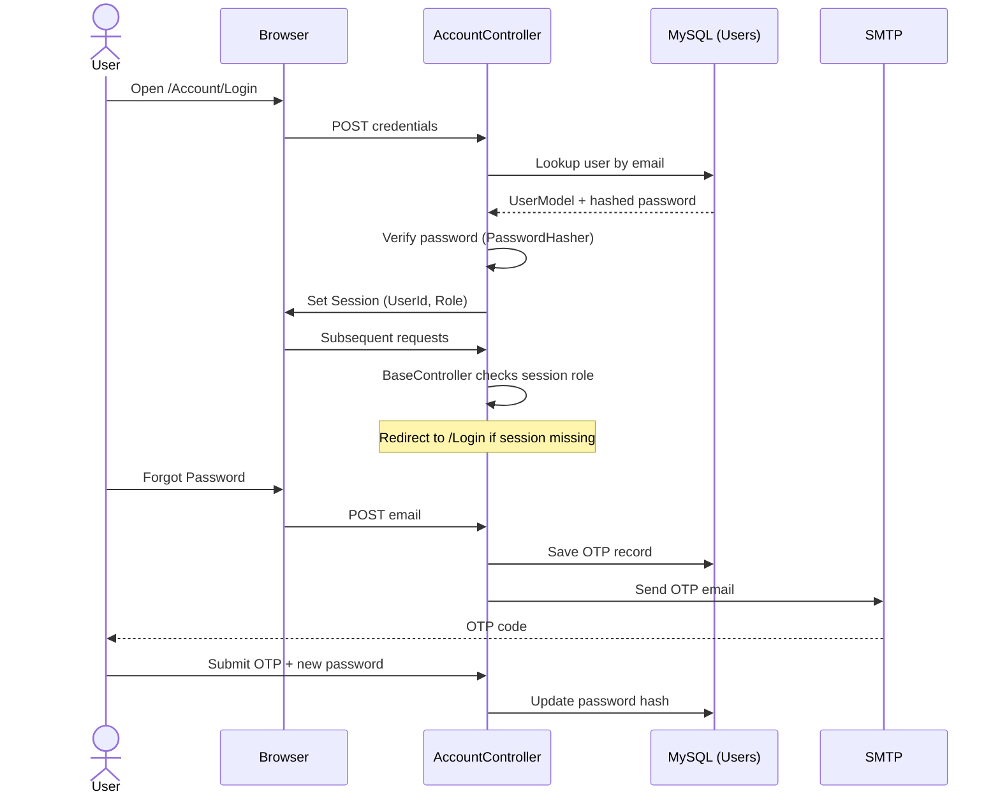

# High-Level Architecture Diagram

UniManage is an ASP.NET Core MVC web application following a layered architecture with session-based authentication and a MySQL database backend.

```mermaid
graph TB
    subgraph Client["Client Layer"]
        Browser["Web Browser"]
    end

    subgraph Web["ASP.NET Core MVC Application"]
        direction TB

        subgraph Presentation["Presentation Layer (Views)"]
            RazorViews["Razor Views (.cshtml)"]
            Layout["_Layout.cshtml\n(Shared Layout)"]
            ViewModels["ViewModels"]
        end

        subgraph Controllers["Controller Layer"]
            AccountCtrl["AccountController\n(Login / Register / OTP)"]
            DashboardCtrl["DashboardController"]
            CoursesCtrl["CoursesController"]
            ModulesCtrl["ModulesController"]
            UsersCtrl["UsersController"]
            EnrollCtrl["EnrollmentsController\nEnrollmentApplicationsController"]
            AssignCtrl["AssignmentsController\nAssignmentSubmissionsController"]
            ExamCtrl["ExamResultsController"]
            AnnouncCtrl["AnnouncementsController"]
            ReportsCtrl["ReportsController"]
            OtherCtrl["DepartmentsController\nBatchesController\nCourseMaterialsController\nRolesController"]
            BaseCtrl["BaseController\n(Session Auth + Role Guard)"]
        end

        subgraph Services["Service Layer"]
            EmailSvc["EmailService\n(IEmailService)"]
        end

        subgraph DataLayer["Data Access Layer"]
            DbContext["ApplicationDbContext\n(Entity Framework Core)"]
            Migrations["EF Migrations"]
        end

        subgraph ModelLayer["Domain Model Layer"]
            Models["Domain Models\n(UserModel, CourseModel, ModuleModel,\nEnrollmentModel, AssignmentModel,\nExamModel, AnnouncementModel, ...)"]
        end
    end

    subgraph Infrastructure["Infrastructure"]
        MySQL["MySQL Database"]
        SMTP["SMTP Server\n(Email / OTP Delivery)"]
        FileStore["File Storage\n(Binary in DB — materials,\nassignment files, submissions)"]
    end

    Browser -->|HTTPS Requests| Controllers
    Controllers --> BaseCtrl
    Controllers --> Services
    Controllers --> DbContext
    Controllers --> ViewModels
    ViewModels --> RazorViews
    RazorViews --> Layout
    Services --> EmailSvc
    EmailSvc -->|SMTP| SMTP
    DbContext --> Models
    DbContext -->|EF Core / Pomelo MySQL| MySQL
    FileStore -.->|stored as byte[] columns| MySQL
```

## Layer Responsibilities

| Layer                    | Responsibility                                                                                                                     |
| ------------------------ | ---------------------------------------------------------------------------------------------------------------------------------- |
| **Presentation (Views)** | Razor views rendered server-side; shared layout with Bootstrap-based UI                                                            |
| **Controllers**          | Handle HTTP requests, enforce session-based authentication via `BaseController`, invoke EF Core queries and services, return views |
| **BaseController**       | Centralises role/session checks; all secured controllers inherit from it                                                           |
| **Service Layer**        | `EmailService` handles OTP and notification emails via SMTP                                                                        |
| **Data Access**          | `ApplicationDbContext` (EF Core with Pomelo MySQL driver); schema managed via EF Migrations                                        |
| **Domain Models**        | C# POCO classes with Data Annotations; represent all entities stored in MySQL                                                      |
| **MySQL**                | Persistent data store including binary file blobs                                                                                  |
| **SMTP**                 | External email provider used for password-reset OTPs                                                                               |

## Authentication Flow


