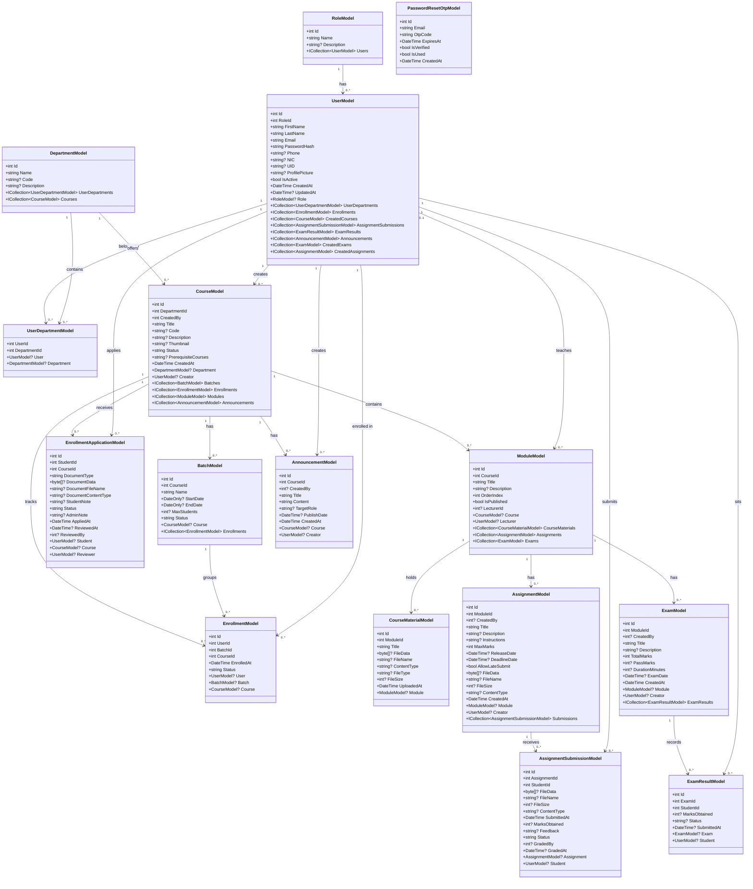

# Class Diagram

Domain model class relationships for the UniManage system.

## Controller — Model Mapping

| Controller                         | Primary Models Used                            |
| ---------------------------------- | ---------------------------------------------- |
| `AccountController`                | `UserModel`, `PasswordResetOtpModel`           |
| `DashboardController`              | `UserModel`, `CourseModel`, `EnrollmentModel`  |
| `CoursesController`                | `CourseModel`, `DepartmentModel`               |
| `BatchesController`                | `BatchModel`, `CourseModel`                    |
| `ModulesController`                | `ModuleModel`, `CourseModel`                   |
| `CourseMaterialsController`        | `CourseMaterialModel`, `ModuleModel`           |
| `AssignmentsController`            | `AssignmentModel`, `ModuleModel`               |
| `AssignmentSubmissionsController`  | `AssignmentSubmissionModel`, `AssignmentModel` |
| `ExamResultsController`            | `ExamResultModel`, `ExamModel`                 |
| `EnrollmentsController`            | `EnrollmentModel`, `BatchModel`, `CourseModel` |
| `EnrollmentApplicationsController` | `EnrollmentApplicationModel`, `CourseModel`    |
| `AnnouncementsController`          | `AnnouncementModel`, `CourseModel`             |
| `DepartmentsController`            | `DepartmentModel`                              |
| `UsersController`                  | `UserModel`, `RoleModel`, `DepartmentModel`    |
| `RolesController`                  | `RoleModel`                                    |
| `ReportsController`                | Multiple models (read-only aggregates)         |
