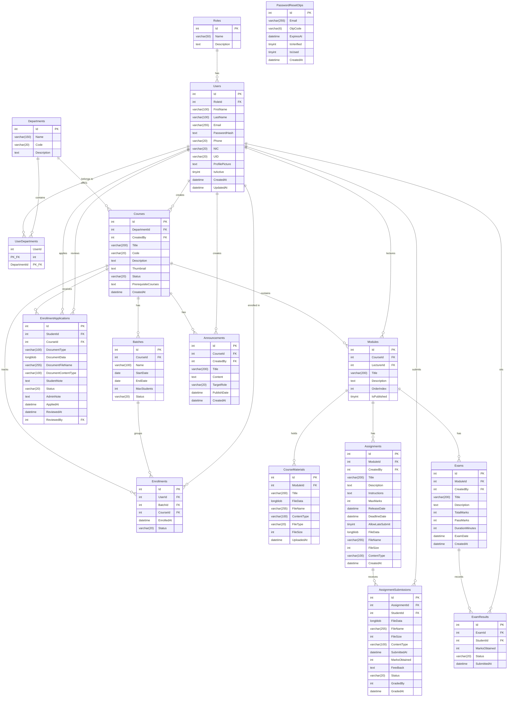

# Database Diagram

Entity-Relationship diagram for the UniManage MySQL database. Schema is managed via Entity Framework Core migrations.

## Table Summary

| Table                    | Rows | Notes                                       |
| ------------------------ | ---- | ------------------------------------------- |
| `Roles`                  | ~3   | student, lecturer, administrator            |
| `Users`                  | Many | Polymorphic — role differentiates behaviour |
| `Departments`            | Many | Faculty/school groupings                    |
| `UserDepartments`        | Many | Composite PK junction table                 |
| `Courses`                | Many | Status: draft / published / archived        |
| `Batches`                | Many | Per-course intake groups                    |
| `Enrollments`            | Many | Student ↔ Batch ↔ Course                    |
| `EnrollmentApplications` | Many | Status: pending / approved / rejected       |
| `Modules`                | Many | Ordered units within a course               |
| `CourseMaterials`        | Many | Binary files stored as `longblob`           |
| `Assignments`            | Many | Binary attachment optional                  |
| `AssignmentSubmissions`  | Many | Status: submitted / graded / late           |
| `Exams`                  | Many | Scheduled per module                        |
| `ExamResults`            | Many | Status: pass / fail / absent                |
| `Announcements`          | Many | Target: all / student / lecturer            |
| `PasswordResetOtps`      | Many | Expiry-controlled, single-use OTP           |

## Key Constraints

- All FK relationships use `int` surrogate keys with auto-increment.
- `UserDepartments` uses a **composite primary key** (`UserId`, `DepartmentId`).
- File data (materials, assignments, submissions, enrollment documents) is stored as **`longblob`** directly in MySQL.
- Soft-delete pattern used via `IsActive` on `Users` and `Status` fields on courses, batches, and enrollments.
