# Use Case Diagram

System actors and their use cases for the UniManage university management system.

## Actors

| Actor             | Description                   |
| ----------------- | ----------------------------- |
| **Guest**         | Unauthenticated visitor       |
| **Student**       | Enrolled learner              |
| **Lecturer**      | Module instructor             |
| **Administrator** | System admin with full access |

---

## Use Case Diagram

```mermaid
graph LR
    Guest(["👤 Guest"])
    Student(["👤 Student"])
    Lecturer(["👤 Lecturer"])
    Admin(["👤 Administrator"])

    subgraph UC["UniManage System"]

        subgraph Auth["Authentication"]
            UC_Login["Login"]
            UC_Logout["Logout"]
            UC_ForgotPwd["Forgot Password"]
            UC_VerifyOTP["Verify OTP"]
            UC_ResetPwd["Reset Password"]
        end

        subgraph Dashboard["Dashboard"]
            UC_Dashboard["View Dashboard"]
        end

        subgraph UserMgmt["User Management"]
            UC_ViewUsers["View Users"]
            UC_CreateUser["Create User"]
            UC_EditUser["Edit User"]
            UC_DeactivateUser["Deactivate User"]
            UC_ViewProfile["View Own Profile"]
            UC_EditProfile["Edit Own Profile"]
        end

        subgraph RoleDept["Roles & Departments"]
            UC_ManageRoles["Manage Roles"]
            UC_ManageDepts["Manage Departments"]
            UC_AssignDept["Assign User to Department"]
        end

        subgraph CourseMgmt["Course Management"]
            UC_ViewCourses["View Courses"]
            UC_CreateCourse["Create Course"]
            UC_EditCourse["Edit Course"]
            UC_PublishCourse["Publish / Archive Course"]
            UC_ManageBatches["Manage Batches"]
        end

        subgraph ModuleMgmt["Module Management"]
            UC_ViewModules["View Modules"]
            UC_CreateModule["Create Module"]
            UC_EditModule["Edit Module"]
            UC_PublishModule["Publish Module"]
            UC_AssignLecturer["Assign Lecturer to Module"]
        end

        subgraph Materials["Course Materials"]
            UC_UploadMaterial["Upload Course Material"]
            UC_ViewMaterial["View / Download Material"]
            UC_DeleteMaterial["Delete Material"]
        end

        subgraph Assignments["Assignments"]
            UC_CreateAssignment["Create Assignment"]
            UC_ViewAssignment["View Assignment"]
            UC_SubmitAssignment["Submit Assignment"]
            UC_GradeSubmission["Grade Submission"]
            UC_ViewGrades["View Own Grades"]
        end

        subgraph Exams["Exams"]
            UC_CreateExam["Create Exam"]
            UC_ViewExam["View Exam Details"]
            UC_EnterResult["Enter Exam Result"]
            UC_ViewResult["View Own Exam Result"]
        end

        subgraph Enrollment["Enrollment"]
            UC_ApplyEnrollment["Apply for Course Enrollment"]
            UC_ReviewApplication["Review Enrollment Application"]
            UC_ApproveReject["Approve / Reject Application"]
            UC_ViewEnrollments["View Enrollments"]
            UC_ManageEnrollment["Manage Enrollments"]
        end

        subgraph Announcements["Announcements"]
            UC_PostAnnouncement["Post Announcement"]
            UC_ViewAnnouncement["View Announcements"]
            UC_EditAnnouncement["Edit Announcement"]
            UC_DeleteAnnouncement["Delete Announcement"]
        end

        subgraph Reports["Reports"]
            UC_ViewReports["View Reports"]
        end

    end

    %% Guest
    Guest --> UC_Login
    Guest --> UC_ForgotPwd
    Guest --> UC_VerifyOTP
    Guest --> UC_ResetPwd

    %% All authenticated
    Student --> UC_Logout
    Lecturer --> UC_Logout
    Admin --> UC_Logout

    Student --> UC_Dashboard
    Lecturer --> UC_Dashboard
    Admin --> UC_Dashboard

    Student --> UC_ViewProfile
    Student --> UC_EditProfile
    Lecturer --> UC_ViewProfile
    Lecturer --> UC_EditProfile
    Admin --> UC_ViewProfile
    Admin --> UC_EditProfile

    %% Admin
    Admin --> UC_ViewUsers
    Admin --> UC_CreateUser
    Admin --> UC_EditUser
    Admin --> UC_DeactivateUser
    Admin --> UC_ManageRoles
    Admin --> UC_ManageDepts
    Admin --> UC_AssignDept
    Admin --> UC_CreateCourse
    Admin --> UC_EditCourse
    Admin --> UC_PublishCourse
    Admin --> UC_ManageBatches
    Admin --> UC_ViewCourses
    Admin --> UC_CreateModule
    Admin --> UC_EditModule
    Admin --> UC_PublishModule
    Admin --> UC_AssignLecturer
    Admin --> UC_ViewModules
    Admin --> UC_ReviewApplication
    Admin --> UC_ApproveReject
    Admin --> UC_ManageEnrollment
    Admin --> UC_ViewEnrollments
    Admin --> UC_ViewReports
    Admin --> UC_PostAnnouncement
    Admin --> UC_EditAnnouncement
    Admin --> UC_DeleteAnnouncement
    Admin --> UC_ViewAnnouncement

    %% Lecturer
    Lecturer --> UC_ViewCourses
    Lecturer --> UC_ViewModules
    Lecturer --> UC_UploadMaterial
    Lecturer --> UC_ViewMaterial
    Lecturer --> UC_DeleteMaterial
    Lecturer --> UC_CreateAssignment
    Lecturer --> UC_ViewAssignment
    Lecturer --> UC_GradeSubmission
    Lecturer --> UC_CreateExam
    Lecturer --> UC_ViewExam
    Lecturer --> UC_EnterResult
    Lecturer --> UC_PostAnnouncement
    Lecturer --> UC_EditAnnouncement
    Lecturer --> UC_ViewAnnouncement

    %% Student
    Student --> UC_ViewCourses
    Student --> UC_ApplyEnrollment
    Student --> UC_ViewEnrollments
    Student --> UC_ViewModules
    Student --> UC_ViewMaterial
    Student --> UC_ViewAssignment
    Student --> UC_SubmitAssignment
    Student --> UC_ViewGrades
    Student --> UC_ViewExam
    Student --> UC_ViewResult
    Student --> UC_ViewAnnouncement
```

---

## Use Case Descriptions

### Authentication

| Use Case        | Actor(s) | Description                                         |
| --------------- | -------- | --------------------------------------------------- |
| Login           | Guest    | Authenticate with email + password; session created |
| Logout          | All      | Invalidate session                                  |
| Forgot Password | Guest    | Request OTP sent to registered email                |
| Verify OTP      | Guest    | Enter 6-digit OTP to confirm identity               |
| Reset Password  | Guest    | Set a new password after OTP verification           |

### User Management

| Use Case              | Actor(s) | Description                                          |
| --------------------- | -------- | ---------------------------------------------------- |
| View Users            | Admin    | List and search all system users                     |
| Create User           | Admin    | Register a new user with an assigned role            |
| Edit User             | Admin    | Update user details, role, status                    |
| Deactivate User       | Admin    | Soft-disable a user account                          |
| View/Edit Own Profile | All      | View and update personal details and profile picture |

### Course & Module Management

| Use Case                  | Actor(s) | Description                                   |
| ------------------------- | -------- | --------------------------------------------- |
| Create / Edit Course      | Admin    | Define a course under a department            |
| Publish / Archive Course  | Admin    | Change course visibility status               |
| Manage Batches            | Admin    | Create and manage intake batches per course   |
| Create / Edit Module      | Admin    | Add ordered modules within a course           |
| Assign Lecturer to Module | Admin    | Designate a lecturer responsible for a module |
| Publish Module            | Admin    | Make a module visible to students             |

### Enrollment

| Use Case             | Actor(s)       | Description                                 |
| -------------------- | -------------- | ------------------------------------------- |
| Apply for Enrollment | Student        | Submit a prerequisite document for a course |
| Review Application   | Admin          | View pending enrollment applications        |
| Approve / Reject     | Admin          | Update application status with admin note   |
| View Enrollments     | Student, Admin | List active enrollments                     |

### Learning Activities

| Use Case                 | Actor(s)          | Description                                 |
| ------------------------ | ----------------- | ------------------------------------------- |
| Upload Course Material   | Lecturer, Admin   | Upload files (PDF, video, link) to a module |
| View / Download Material | Student, Lecturer | Access uploaded materials                   |
| Create Assignment        | Lecturer, Admin   | Define assignment with deadline and marks   |
| Submit Assignment        | Student           | Upload file submission for an assignment    |
| Grade Submission         | Lecturer, Admin   | Award marks and feedback to a submission    |
| View Grades              | Student           | See marks and feedback for own submissions  |
| Create Exam              | Lecturer, Admin   | Schedule an exam for a module               |
| Enter Exam Result        | Lecturer, Admin   | Record marks and pass/fail status           |
| View Exam Result         | Student           | See own exam result                         |

### Announcements & Reports

| Use Case           | Actor(s)        | Description                                            |
| ------------------ | --------------- | ------------------------------------------------------ |
| Post Announcement  | Lecturer, Admin | Publish a message to a course audience                 |
| View Announcements | All             | Read course announcements                              |
| View Reports       | Admin           | Aggregate statistics on enrollments, results, activity |
